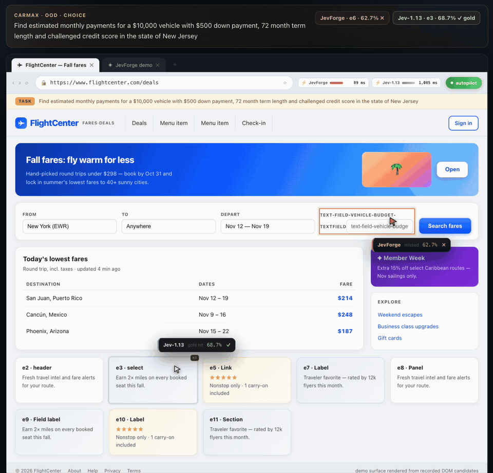

<div align="center">


# JevForge

**面向网页交互决策，集数据合成、候选评分模型训练与校准、固定评测、Jev 兼容推理于一体的开源工具链。**

数据合成 · 训练与校准 · 固定评测 · Jev 兼容服务

[交互演示](https://jev-forge.vercel.app) · [HF 模型](https://huggingface.co/AndeyTait/JevForge-0.8B) · [HF 数据集](https://huggingface.co/datasets/AndeyTait/JevForge-Mind2Web) · [数据格式](docs/DATASET.md) · [English](README.md) · [设计文档](docs/DESIGN.md) · [W&B](https://wandb.ai/760243703-renmin-university-of-china/jevforge/runs/4bdfb291)

</div>

JevForge 把结构化决策变成一条可复现的完整流水线。输入状态、问题和候选集合，
它负责构建训练记录、训练与校准评分器、运行固定评测，并通过 Jev 兼容 API
返回完整概率分布。`choice`、`noul` 和有序 `score` 共用同一条决策路径。

它首先聚焦 Jev 式系统最核心的交互闭环：从页面当前可用元素中选择下一次点击、
导航目标、表单控件、路由或升级处理动作。

[](https://jev-forge.vercel.app)

## 结果

仓库中的评测使用固定、按网站隔离的 test/OOD 划分。0.8B 版本使用
Qwen3.5 预训练 backbone，与 0.6B 运行使用相同数据与评测协议；Jev-1.13 作为
同一候选集上单独测量的参考组。

| 指标 | 原始 Qwen3.5-0.8B¹ | JevForge 0.8B | JevForge 0.6B | Jev-1.13 |
|---|---:|---:|---:|---:|
| Test choice top-1 | 0.235 | **0.579** | 0.439 | 0.543 |
| OOD choice top-1 | 0.340 | **0.637** | 0.500 | 0.610 |
| Test noul accuracy / Brier | — | 0.826 / **0.128** | 0.776 / 0.170 | 0.910 / 0.092 |
| OOD noul accuracy / Brier | — | **0.860 / 0.117** | 0.769 / 0.175 | 0.825 / 0.131 |
| Test / OOD score MAE | — | 0.367 / **0.390** | 0.488 / 0.481 | **0.348** / 0.463 |

¹ 原始 backbone 使用每个冻结划分的前 200 条记录做 zero-shot 候选打分；
训练后模型和参考组列使用各自已记录的完整评测集。

## 决策结构


JevForge 把一个问题展开成 K 行：每行共享页面状态和问题，只替换当前候选
路径。系统取每行最后一个有效 token 的表示，用同一个两层 GELU 评分头
产生标量，再只对属于同一问题的 K 个 logit 做 softmax。这才是 JevForge 自己的
决策结构：候选之间可比、不确定性可见，也不需要生成文本。

具体版本的 backbone 和初始化方式放在 [MODEL_CARD.md](MODEL_CARD.md)，不再当作
JevForge 的主架构介绍。

## 一键本地运行并看到点击

在 Apple Silicon Mac 上运行一条命令，会自动从 Hugging Face 下载 0.8B 权重、
选择 MPS、启动本地 Jev 兼容接口，并打开真实调用模型的网页。页面会展示
本机推理耗时、完整候选概率，然后执行模型选中的 DOM 点击。

```bash
bash scripts/run_mac_demo.sh
```

## API 快速开始

```bash
python -m venv .venv
source .venv/bin/activate
pip install -r requirements.txt
python -m jevforge.serve --checkpoint-dir checkpoints/JevForge-0.8B --port 8123
```

## 复现实验

流程从 Mind2Web 标注构建网站隔离的数据划分，补齐缺失的决策标签分布，
用交叉熵和 Brier 目标微调预训练 0.8B backbone，完成温度校准后在冻结的
test/OOD 划分上评测。

[数据格式说明](docs/DATASET.md) 给出了 Mind2Web 字段映射、完整 JSONL 样例、
数据划分原则，以及迁移到自定义任务时必须提供的字段。

```bash
bash scripts/qwen35_08b_pipeline.sh
```

本地 JSONL 是训练指标的事实来源；W&B 只是可选镜像。只有当线上 run 的
配置和最终产物与本地输出一致时，才把链接作为发布证据。

## 目录

```text
jevforge/    schema、编码、模型、训练、推理、服务和评测
scripts/     数据、训练、评测与发布脚本
docs/        设计与实现说明
examples/    可在本地校验的小型虚构样例
```

交互站点单独维护，部署在
[jev-forge.vercel.app](https://jev-forge.vercel.app)。

## 研究路线

- [x] 数据构建、训练、校准、评测与服务完整链路
- [x] Jev 兼容的 `choice`、`noul` 与有序 `score` 推理
- [x] 网站隔离评测与可交互决策回放
- [ ] **面向校准决策的强化学习** — 参考
  [TypeSafe 对 Jev 的介绍](https://typesafe.ai/blog/introducing-system-one-models-and-jev)
  构建 RLCD 风格训练环，同时优化任务效用与概率校准，并评测 Brier、ECE、
  selective risk 和 OOD 准确率。
- [ ] **更通用的结构化决策** — 扩展到意图路由、工具/API 选择、安全与升级分诊、
  文档分类，以及有序策略/风险评分。
- [x] **Qwen3.5-0.8B 受控运行** — 使用同一固定数据与评测协议，从上游
  预训练权重初始化，并作为独立结果组报告。

## 数据与许可

- 代码采用 MIT License。
- 当前发布 backbone 为 Qwen3.5-0.8B；分发权重需同时遵守 Qwen 上游许可。
- Mind2Web 衍生记录托管在
  [公开数据集](https://huggingface.co/datasets/AndeyTait/JevForge-Mind2Web)，
  来源与条款见 [THIRD_PARTY_NOTICES.md](THIRD_PARTY_NOTICES.md)。
- Jev-1.13 作为单独的参考对照报告。

JevForge 是一个个人独立研究项目，探索开放的结构化决策模型与 Jev 式接口。

> 评测说明：当前版本在固定、按网站隔离的 Mind2Web 衍生记录上报告候选评分结果。
