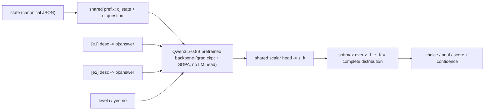
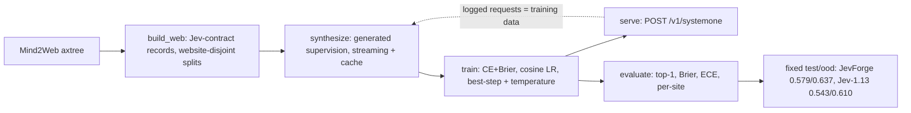

# JevForge diagrams (Mermaid sources)

Rendered assets live in the separate
[JevForge web project](https://jev-forge.vercel.app). These Mermaid sources
are kept here so GitHub renders the architecture natively.

## Architecture - one forward, no decoding

## One-stop pipeline with the data flywheel

